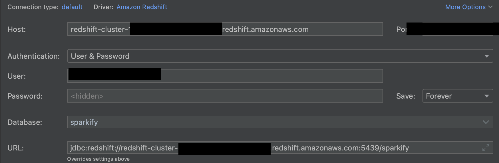
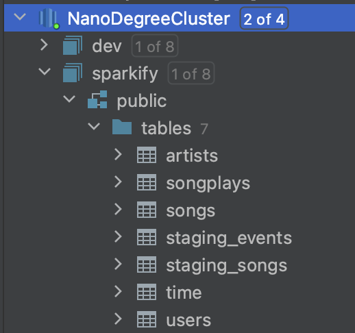
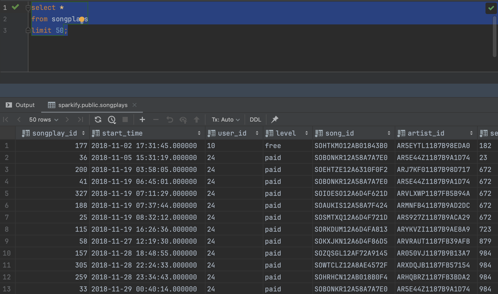

# Project - Data-Warehouse

## Project Description

This project has to purpose to support a startup called Sparkify, with time it has grown their user base and song database and want to move their processes and data onto the cloud.
Thei data resides in S3, in a directory of JSON logs on user activity on the app, as well as a directory with JSON metadata on the songs in their app.
As their data engineer, you are tasked with building an ETL pipeline that extracts their data from S3, stages them in Redshift, and transforms data into a set of dimensional tables for their analytics team to continue finding insights into what songs their users are listening to.

### Scripts/files
* `create_tables.py` - python script that manages the objects of the Data Warehouse, it drops and creates de tables when called
* `etl.py` - Copies all files from S3 into the staging tables, and
* `dwh.cfg` - Config file with the necessary info to connect to the redshift cluster
* `sql_queries.py` - defines all the sql queries need to create the tables and all insert statements

## DB Design

The schema design is based on the concept of a star schema. It is desgined to analyse the data regarding song playing.
This type of modeling takes advantage of denormalization and fast aggregation.
It will help Sparkify answer their questions with fast and reliable data.

## Tables 

### Staging Table

1. **staging_events** - staging table where the data from the events is first copied from S3 to Redshift
   * event_id, artist, auth, first_name, gender, item_in_session, last_name, lenght, level, location, method, page, registration, session_id, song, status, ts, user_agent, user_id

2. **staging_songs** - staging table where the data from the songs is first copied from S3 to Redshift
   * song_id, num_songs, artist_id, artistc_latitude, artist_longitude, artist_location, artist_name, song_id, title, duration, year

### Fact Table

1. **songplays** - records in log data associated with song plays
   * songplay_id, start_time, user_id, level, song_id, artist_id, session_id, location, user_agent

### Dimension Tables

2. **users** - users in the app
   * user_id, first_name, last_name, gender, level

3. **songs** - songs in music database
   * song_id, title, artist_id, year, duration

4. **artists** - artists in music database
   * artist_id, name, location, latitude, longitude

5. **time** - timestamps of records in songplays broken down into specific units
   * start_time, hour, day, week, month, year, weekday


## How to run locally

1. Clone repo and change diretory

```bash
git clone git@github.com:Alkarya/Data-Warehouse-Projectt.git

cd data-warehouse-projectt
```

2. Create Python venv

On a new terminal run:
```bash
python3 -m venv python-venv            
source python-venv/bin/activate 
```

3. Install requirements

```bash
pip install -r requirements.txt
```

4. If needed create a Redshift cluster

5. Add necessary info to the dwh.cfg file

```cfg
HOST=<insert_host_here>
DB_NAME=<insert_db_here>
DB_USER=<insert_user_here>
DB_PASSWORD=<insert_user_password_here>
DB_PORT=<insert_port_here> (usually default is 5439)

[IAM_ROLE]
ARN=<insert_role_here>
```

6. Run python scripts

```bash
python -m create_tables
python -m etl
```

6. Closing and cleaning the local environment

```bash
deactivate
rm -r python-venv
```

7. Delete redshift cluster

## Check the data

Using Datagrip we can check the database and query the data.

1. Connect to Redshift



1. All the tables have been created



1. The data is available (one table as an example)



## References

* [Convert epoch to timestamp](https://stackoverflow.com/questions/39815425/how-to-convert-epoch-to-datetime-redshift) 
